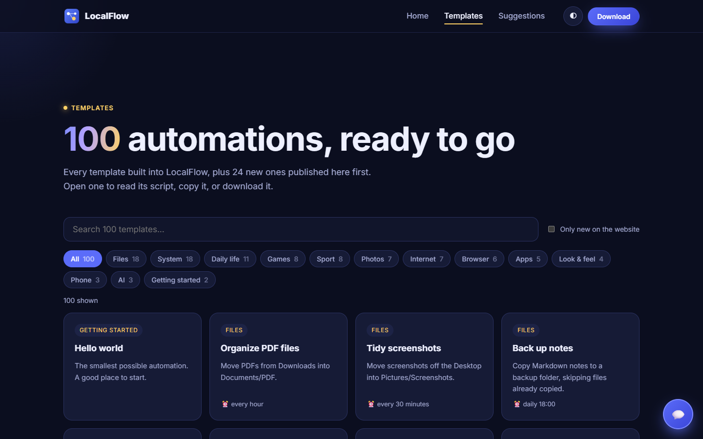
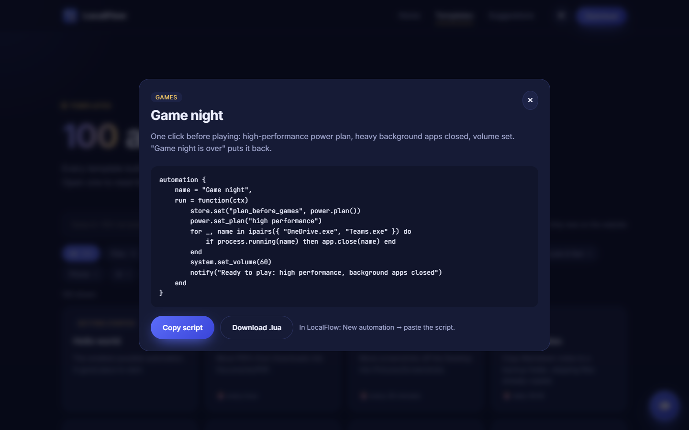

<div align="center">


# LocalFlow

**Your PC, on autopilot.** Small Lua automations that run on a schedule, on a trigger, or when you just ask out loud — privately, on your own computer.

[](https://localflow-9dp.pages.dev)
[](https://github.com/HoPMaLbHblu/LocalFlow/releases/latest)


[**Website**](https://localflow-9dp.pages.dev) · [**100 templates**](https://localflow-9dp.pages.dev/templates) · [**Suggest a feature**](https://localflow-9dp.pages.dev/suggestions) · [**Download**](https://github.com/HoPMaLbHblu/LocalFlow/releases/latest)

<a href="https://localflow-9dp.pages.dev"></a>

</div>

<table>
<tr>
<td width="33%" valign="top">

**⏰ Schedules & triggers**<br/>
Every morning, every 15 minutes, when a file appears, an app starts, the battery drops or the PC goes idle.

</td>
<td width="33%" valign="top">

**🎙️ Voice control**<br/>
Say what you want in English, Russian or German. LocalFlow asks before anything it can't undo.

</td>
<td width="33%" valign="top">

**🧩 Simple Lua scripts**<br/>
A friendly API for files, apps, windows, network, clipboard, images and more — plus an AI helper that drafts scripts for you.

</td>
</tr>
<tr>
<td valign="top">

**📱 Phone & chat**<br/>
Reports in Telegram or Discord, and commands to your PC from your phone.

</td>
<td valign="top">

**📈 System monitor**<br/>
Processor, memory, disk and battery history, with automations that react to it.

</td>
<td valign="top">

**🛡️ Private & safe**<br/>
No account, no cloud. Risky actions need your permission; deleted files go to the Recycle Bin.

</td>
</tr>
</table>

<details>
<summary><b>📸 More from the website</b></summary>
<br/>
<a href="https://localflow-9dp.pages.dev/templates"></a>
<a href="https://localflow-9dp.pages.dev/templates/#game-night"></a>
</details>

> 💬 **Questions or ideas?** Chat with the developer or post a suggestion on [the website](https://localflow-9dp.pages.dev).

**Contents:** [Install](#install-the-desktop-app) · [Writing automations](#writing-automations) · [Lua API](#lua-api) · [Telegram](#control-your-pc-from-telegram) · [Dota 2 companion](#dota-2-companion) · [Phone remote](#phone-remote-android) · [Voice control](#voice-control) · [Your data is safe](#your-data-is-safe) · [Web server](#web-server) · [Development](#development)

## About

Automate chores on your computer with small **Lua** scripts: tidy your Downloads folder, back up notes, move screenshots. Run them with one click or on a schedule. LocalFlow lives in the system tray on Windows (the icons next to the clock on the taskbar) or the menu bar on a Mac, and keeps your schedules running in the background. Available in English, Russian and German, with light and dark themes.

LocalFlow comes in two flavours that share the same engine:

- **Desktop app** (Windows and macOS): a native window with a code editor, test runs, live logs, a system tray / menu bar icon, desktop notifications, start at sign-in, light/dark themes and English/Russian/German.
- **Web server**: the basics (create, edit, schedule, run, logs) in your browser at `http://127.0.0.1:3000`, for headless machines. Folder watching, extra triggers, system control, import/export and backups are desktop-only.

## Install the desktop app

**Windows:** download `LocalFlow_x.y.z_x64-setup.exe` from the [latest release](../../releases/latest) and run it. No administrator rights are needed.

**Mac** (macOS 11 or newer, Apple Silicon or Intel): download `LocalFlow_x.y.z_universal.dmg` from the [latest release](../../releases/latest), open it and drag **LocalFlow** into **Applications**. LocalFlow isn't notarized by Apple yet, so the first time, right-click (or Control-click) LocalFlow in Applications and choose **Open**, then **Open** again. If macOS still refuses, go to **System Settings › Privacy & Security** and click **Open Anyway**. After that it opens normally.

After installing:

1. Click **+ New automation** and pick one of the 78 templates (search them or browse by category), for example *Hello world*, or start from a blank one.
2. Press **Test run** (Ctrl+Enter, or ⌘ Enter on a Mac) to try it without saving.
3. Press **Save** (Ctrl+S, or ⌘ S). Choose a **schedule** to run it automatically.
4. Close the window whenever you like. LocalFlow keeps running in the system tray (the icons next to the clock on the taskbar; click **^** if you don't see it). Right-click its icon there and choose **Quit** to exit. On a Mac, LocalFlow's icon is in the menu bar at the top right of the screen; click it for the menu, or press ⌘ Q to quit.

Turn on **Settings → Start with Windows** (**Open at login** on a Mac) so schedules survive a reboot. **Settings → Appearance** switches between light, dark and system theme, and between English, Русский and Deutsch.

## Writing automations

```lua
automation {
    name = "Organize PDF files",

    run = function(ctx)
        local files = fs.list("~/Downloads", "*.pdf")

        for _, file in ipairs(files) do
            fs.move(file, "~/Documents/PDF/" .. fs.basename(file))
            log("Moved file: " .. file)
        end

        notify("Organized " .. #files .. " PDF file(s)")
    end
}
```

`run(ctx)` is called each time the automation runs. A script without an `automation { ... }` block also works; its top-level code simply runs.

### Lua API

| Function | What it does |
|---|---|
| `fs.list(path, pattern)` | Files in a folder whose names match a wildcard like `"*.pdf"` or `"IMG_????.jpg"` (case-insensitive). `pattern` defaults to `"*"`. |
| `fs.move(source, destination)` | Moves or renames a file. If `destination` is an existing folder, the file keeps its name. Missing parent folders are created. Refuses to overwrite. Returns the new path. |
| `fs.copy(source, destination)` | Copies a file (same destination rules). A file it replaces goes to the Recycle Bin first. Returns the new path. |
| `fs.exists(path)` | `true` if the file or folder exists. |
| `fs.delete(path)` | Moves a file or folder to the **Recycle Bin** (never deletes permanently). Returns `false` if it did not exist. |
| `fs.mkdir(path)` | Creates a folder and its parents. |
| `fs.basename(path)` | The file name: `"report.pdf"` for `"~/Downloads/report.pdf"`. |
| `fs.join(a, b, ...)` | Joins path parts. |
| `fs.is_dir(path)` | `true` if the path is a folder. |
| `fs.size(path)` | File size in bytes. |
| `fs.modified(path)` | When the file last changed, as a timestamp. |
| `app.open(what, args)` | Opens an app by its Start-menu name (`"Spotify"`), a file or folder with its usual app, a website, or a program by path. `args` is an optional list of options for a program. |
| `app.running(name)` | `true` if a program with that name is running (`"Discord"`, `"chrome"`; `.exe` and capitals don't matter). |
| `app.list()` | Names of the programs running now. |
| `app.shortcuts()` | Names of the apps in the Start menu, which are the names `app.open` understands. |
| `wait(seconds)` | Pauses the script (within its time limit). |
| `time.now()` | The current time as a timestamp (seconds since 1970). |
| `time.format(pattern, t)` | A timestamp as text, e.g. `time.format("%d.%m.%Y")`. Both arguments optional. |
| `time.date(t)` | A timestamp split into `year`, `month`, `day`, `hour`, `min`, `sec`, `weekday` (1 = Monday) and `yday`. |
| `time.today()` | Today's date, `"2026-09-29"`. |
| `time.parse(text, format)` | Date text such as `"2026-09-29 14:05"` as a timestamp, or `nil` if it isn't a date. `format` is optional, e.g. `"%d.%m.%Y"`. |
| `time.make{ year, month, day, hour, min, sec }` | A timestamp from parts; values roll over like a calendar (`day = 32` in January is February 1st). |
| `time.days(n)`, `time.hours(n)`, `time.minutes(n)` | Durations in seconds, for comparing with timestamps. |
| `fs.read(path)` / `fs.write(path, text)` / `fs.append(path, text)` | Read, create/replace, or add to a text file. |
| `fs.rename(path, new_name)` | Renames in place; never overwrites. |
| `fs.list_dirs(folder)` | The folders inside a folder. |
| `fs.find(folder, pattern)` | Files matching `pattern` in the folder and all subfolders. |
| `fs.largest(folder, count)` | The biggest files below a folder, as `{ path, size }`. |
| `fs.hash(path)` | SHA-256 of a file. |
| `zip.create(zip_path, source)` / `zip.extract(zip_path, folder)` | Make or unpack zip archives (paths escaping the target folder are refused). |
| `security.scan(folder, options)` | File names typical of malware: words like *trojan*, *rootkit*, *keylogger* on programs, scripts and archives; fake double extensions (`invoice.pdf.exe`); Windows system program names outside the Windows folder. **Name-based only, not an antivirus.** |
| `system.disks()`, `system.disk_free(path)`, `system.memory()`, `system.cpu()`, `system.battery()`, `system.uptime()`, `system.computer_name()`, `system.user_name()`, `system.os()` | Information about the computer. |
| `clipboard.get()` / `clipboard.set(text)` | Read or set the clipboard text. |
| `ask(question, title)` | Yes/No dialog; returns `true` for Yes. |
| `sound.beep()` / `sound.play(wav_path)` | Play the Windows sound or a `.wav` file. |
| `json.encode(value, pretty)` / `json.decode(text)` | Convert between Lua tables and JSON. |
| `http.get(url, opts)` / `http.post(url, opts)` | Web requests; `opts` can hold `headers`, `json` or `body`. Returns `{ status, ok, body }`. |
| `store.get(key, default)` / `store.set(key, value)` / `store.delete(key)` | Values kept between runs of the same automation. |
| `log(message)` / `print(...)` | Writes a line to the automation's log. |
| `notify(message)` | Shows a desktop notification (desktop app) and writes a `notify` log line. |

Searches (`fs.find`, `fs.largest`, `fs.duplicates`, `security.scan`) stop at the script's time limit and then return what they found plus `false` as a second value. For a whole-disk scan, add the disk (e.g. `C:\`) under **Settings › Allowed folders** and raise **Settings › Script time limit** (up to 1 hour).

`ctx` contains `ctx.id`, `ctx.name` and `ctx.trigger`: `"manual"`, `"tray"` (system tray menu), `"schedule"`, `"startup"`, `"watch"`, `"hotkey"`, `"app_start"`, `"app_exit"`, `"idle"`, `"usb"`, `"after"`, `"step"` or `"test"`. Depending on the trigger it also has `ctx.file` (folder watch), `ctx.app` (app started or closed), `ctx.drive` (USB drive), and `ctx.input` and `ctx.previous` (see *Combining automations*).

Paths: `~` is your home folder, and relative paths are relative to it. `/` works as a separator on every OS.

The editor autocompletes these functions, shows what they do when you hover over them, and marks syntax errors as you type. The **Help** panel next to the editor has ready-made snippets, and **Learn** in the sidebar is a short guide to Lua for beginners.

### Ways to start an automation

| Trigger | How |
|---|---|
| **Run now** | The button in the editor, or right-click the LocalFlow icon in the system tray (next to the clock on the taskbar) › **Run** › pick an automation. |
| **Schedule** | Pick a preset or a custom cron expression (below). |
| **When LocalFlow starts** | Tick *Run when LocalFlow starts*. With **Settings › Start with Windows** this runs every time you sign in, which is perfect for opening your apps. |
| **New file in a folder** | Tick *Run when a new file appears in a folder* and choose the folder and, optionally, a pattern such as `*.pdf`. The automation runs once per new file, after it has finished downloading, with the file in `ctx.file`. |
| **After another automation** | Under *More triggers and permissions*, pick an automation and whether to run when it worked, failed, or either way. |
| **Hotkey, app, idle, USB** | See *Controlling the computer* below. |

Example: open your apps when you sign in.

```lua
automation {
    name = "Open my work apps",

    run = function(ctx)
        for _, name in ipairs({ "Spotify", "Discord", "notepad" }) do
            if not app.running(name) then
                app.open(name)
                wait(1)
            end
        end
    end
}
```

### Controlling the computer

These functions control the whole PC. Everything marked 🔒 only works when **Allow system control** is switched on for that automation (under *More triggers and permissions* in the editor). Imported automations never have it switched on.

| Function | What it does |
|---|---|
| 🔒 `shell.run(cmd, { cwd, timeout })` / `shell.powershell(script, …)` | Run a Command Prompt or PowerShell command without a window; returns `{ code, ok, output, error }`. |
| `process.list()` / `process.running(name)` / `process.wait_for(name, seconds)` | See which programs run. |
| 🔒 `process.kill(name_or_pid)` | Stop a program (Windows' own processes are protected). |
| `window.list()` / `window.find(text)` / `window.active()` | Visible windows with title, app, position and size. |
| 🔒 `window.focus/minimize/maximize/restore/close(w)` / `window.move(w, x, y, width, height)` | Arrange windows; `close` asks the app politely, like clicking X. |
| 🔒 `keyboard.press("ctrl+shift+esc")` / `keyboard.type(text)` | Key combinations (incl. media keys) and typing. |
| 🔒 `mouse.move(x, y)` / `mouse.click(x, y, button, double)` · `mouse.position()` · `screen.size()` | Mouse and screen. |
| 🔒 `system.lock()` / `system.sleep()` / `system.shutdown(delay)` / `system.restart(delay)` / `system.cancel_shutdown()` | Power; shutdown and restart always leave time to cancel (`shutdown /a`). |
| 🔒 `system.volume_up/down(steps)` / `system.mute()` / `system.brightness(percent)` / `system.set_wallpaper(path)` | Sound and display. |
| 🔒 `system.wake_at("07:30")` / `system.cancel_wake()` | Wake the PC from **sleep** at a time (a shut-down PC can only be switched on by the BIOS). Windows must allow wake timers. |
| `system.idle_seconds()` · `network.wake_on_lan(mac)` | Time since the last input; wake another PC on the network. |
| `desktop.dark_mode()` / 🔒 `desktop.set_dark_mode(on, part)` | Dark or light mode. Windows keeps apps and the taskbar separately: `dark_mode()` returns both, and `part` is `"apps"`, `"system"` (taskbar) or left out for both. |
| `desktop.transparency()` / 🔒 `desktop.set_transparency(on)` | Transparency effects. |
| `desktop.accent_color()` / 🔒 `desktop.set_accent_color("#0078d4")` | The accent colour. |
| `desktop.wallpaper()` / 🔒 `desktop.set_wallpaper(path, "fill")` | The wallpaper, with fill, fit, stretch, center, tile or span. |
| `system.volume()` / 🔒 `system.set_volume(35)` · `system.muted()` / 🔒 `system.set_mute(on)` | Exact volume and mute. |
| `power.plans()` / `power.plan()` / 🔒 `power.set_plan("power saver")` | Power plans, by the same English names in every language. |
| 🔒 `power.set_screen_off(minutes)` / 🔒 `power.set_sleep(minutes)` | Screen-off and sleep timers (0 = never), optionally just `"plugged"` or `"battery"`. |
| `mouse.speed()` / 🔒 `mouse.set_speed(10)` | Pointer speed, 1 to 20. |
| `explorer.hidden_files()` / 🔒 `explorer.set_hidden_files(on)` · `explorer.file_extensions()` / 🔒 `explorer.set_file_extensions(on)` | What File Explorer shows. |
| 🔒 `process.set_efficiency(app, on)` · `process.efficiency(app)` | Efficiency mode, like Task Manager's leaf button: lowest priority plus Windows power throttling (EcoQoS). |
| 🔒 `process.set_priority(app, level)` · `process.priority(app)` | Priority: `low`, `below_normal`, `normal`, `above_normal`, `high`. |
| `links.open(set_or_list, { browser, new_window })` | Open a link set (from the **Links** page) or a list of addresses in Chrome, Edge, Firefox, Brave, Opera, Yandex or the default browser. |
| `links.save` · `links.get` · `links.add` · `links.remove` · `links.list` · `links.delete` · `links.import_bookmarks(folder, browser, save_as)` | Manage link sets; import a bookmarks folder. |
| `screen.capture(path)` | Saves a screenshot (`.png` or `.jpg`); never overwrites. |
| `speak(text)` | Reads text aloud. |
| `network.online()` · `network.ping(host, port)` · `network.port_open(host, port)` · `network.wifi()` · `network.local_ip()` | Internet and home-network checks. |
| `http.download(url, path)` | Downloads a file safely (no half files, no overwriting). |
| `process.top(count, "cpu" \| "memory")` | The busiest programs. |
| `env.get(name)` | An environment variable. |
| `service.list()` / `service.status(name)` / 🔒 `service.start` · `stop` · `restart(name)` | Windows services. |
| `packages.updates()` / 🔒 `packages.install(id)` / 🔒 `packages.upgrade(id \| "all")` | App updates with winget. |
| `telegram.send(text)` · `telegram.send_photo(path, caption)` · `telegram.send_file(path, caption)` · `telegram.commands()` | Your own Telegram bot (set up in Settings). |
| `discord.send(text)` · `discord.send_file(path, text)` | A Discord channel's webhook (set up in Settings). |

**On a Mac** the same functions work, with a few differences:

- The first time an automation controls windows, the keyboard, the mouse or locks the screen, macOS asks you to allow LocalFlow under **System Settings › Privacy & Security › Accessibility** (and to let it control "System Events"). Allow it once and run again.
- `shell.run` uses the Mac's shell (`sh`), so write Mac commands (`ls`, `open`, `say`). `shell.powershell` needs PowerShell installed (`brew install powershell`).
- `app.open("Safari")` opens apps from Applications; `app.shortcuts()` lists them.
- `system.wake_at` asks for your administrator password (macOS requires it for wake timers). `system.brightness` isn't available: macOS doesn't let apps change it.
- `ask`, `sound.beep`, `sound.play`, the battery, idle time, volume, mute, wallpaper, sleep, lock, shutdown and restart all work.
- `fs.delete` and replaced files go to the Mac's Trash.

More triggers, also under *More triggers and permissions*: a global **hotkey** (e.g. `Ctrl+Alt+K`), **when an app starts** or **closes** (`ctx.app`), **when the PC is idle** for some minutes, and **when a USB drive is plugged in** (`ctx.drive`; that run may read and write the drive).

### Combining automations

Build something big out of small automations. A script can run other saved automations as **steps**, pass them data, and use what they return:

```lua
local project = automations.call("Make project folder", { name = "Holiday photos" })
automations.call("Write readme", project)   -- gets step 1's result as ctx.input
```

| Function | What it does |
|---|---|
| `automations.call(name, input)` | Runs a saved automation and returns what its `run` returned. Stops this script if the step fails. |
| `automations.run(name, input)` | The same, but never stops the script: returns `{ ok, error, result }`. |
| `automations.list()` | All automations as `{ id, name, enabled }`. Switched-off ones still work as steps. |

Steps share the main automation's time limit and keep their own *Allow system control* setting and saved values. An automation can't call itself (not even through other steps), and chains stop after 8 automations in a row. Without code, the **After another automation** trigger does the same: the first automation's result arrives as `ctx.input` and its name as `ctx.previous`.

### Files, pictures, spreadsheets and passwords

| Function | What it does |
|---|---|
| `fs.duplicates(folder, pattern)` | Groups of files with identical contents, biggest first: `{ size, hash, files }`. |
| `image.info(path)` | `{ width, height, format }` of a PNG, JPG, WebP, GIF or BMP. |
| `image.resize(source, destination, max_width, max_height)` | A smaller copy that keeps its shape (never enlarges). The new file's extension picks the format. |
| `image.convert(source, destination)` | The picture in another format, by extension. |
| `image.taken(path)` | When a photo was taken (from the camera's EXIF data), or `nil`. |
| `csv.read(path, { header, separator })` / `csv.write(path, rows, { header, separator })` | Read and write CSV files that Excel opens. With a header, rows are tables by column name. |
| `crypto.encrypt(source, destination, password)` / `crypto.decrypt(...)` | Lock a copy of a file with a password (XChaCha20-Poly1305, Argon2 key; 8+ characters). **A forgotten password can't be recovered.** |
| `crypto.password(length)` | A random password. |
| `metrics.average(name, minutes)` / `metrics.peak(...)` / `metrics.lowest(...)` | `"cpu"`, `"memory"`, `"disk"` or `"battery"` in % over the last minutes (default 60), or `nil` without history. |
| `metrics.recent(minutes)` / `metrics.latest()` | The recorded samples `{ at, cpu, memory, disk, battery }`. |

LocalFlow records CPU, memory, disk and battery use once a minute while it runs, keeps it for 30 days on your PC only, and shows it as a chart on the overview page.

### AI (GigaChat)

LocalFlow can use **GigaChat** by Sber, with your own key:

1. Get an **authorization key** at [developers.sber.ru](https://developers.sber.ru/studio) (GigaChat API › your project › API settings).
2. Paste it in **Settings › AI**, choose the account type (personal or business) and the model, and press **Test**.

The key is kept in Windows Credential Manager (the Keychain on a Mac), never in LocalFlow's files, and scripts can use the AI but never read the key. Imported automations that use the AI are marked on the import screen.

| Function | What it does |
|---|---|
| `ai.ask(question, { system, model, temperature, max_tokens })` | Asks GigaChat and returns the answer as text. |
| `ai.chat({ { role = "user", content = "..." }, ... }, options)` | A whole conversation. |
| `ai.available()` | `true` when a key is saved. |
| `ai.ask(question, { cache_hours = 24 })` | Reuses the saved answer to the exact same question (saves tokens). **Settings › AI** shows how many answers are saved and can clear them. |
| `ai.conversation(name)` | A chat that remembers earlier questions between runs: `chat:ask(text)`, `chat:history()`, `chat:forget()`. |

```lua
local text = fs.read("~/Documents/meeting notes.txt")
local summary = ai.ask("Summarize in 3 bullet points:\n" .. text, { system = "Answer in English." })
fs.write("~/Documents/meeting summary.txt", summary)
```

**Write with AI**: in the editor, describe an automation in plain words and GigaChat writes the Lua code for you to review and test. With **Change the current code** ticked, it edits what's already in the editor ("also send a notification at the end") instead of starting over. LocalFlow gives GigaChat the exact list of functions that exist and checks its code for syntax errors and made-up functions, giving it up to three tries before showing you what's still wrong. The text you send to the AI goes to Sber's servers; LocalFlow's certificate for them (the Russian Trusted Root CA) is used only for GigaChat's own connection.

### Sharing automations

Press **Export** on an automation to save it as a `.localflow` file (plain JSON with the name, code and triggers) and send it to anyone. To import one, use **📥 Import** in the sidebar, double-click the file, or drag it onto the LocalFlow window.

The import screen shows the code and what the automation can do (delete, move or write files, open programs, use the internet or the clipboard, run by itself). **Imported automations always arrive switched off**, so you can read them and do a Test run first. Only import automations from people you trust.

### Schedules

Pick a preset in the editor (every 5 minutes, every hour, weekdays at 9:00, ...) or choose **Custom** and write a cron expression with **six** fields, seconds first, in your local time zone:

```
┌ second (0-59)
│ ┌ minute (0-59)
│ │ ┌ hour (0-23)
│ │ │ ┌ day of month (1-31)
│ │ │ │ ┌ month (1-12)
│ │ │ │ │ ┌ day of week (0-6 or Sun-Sat)
0 */5 * * * *
```

Disabling an automation pauses its schedule; you can still run it manually.

### Built-in helper library

Scripts can load helpers written in Lua with `require`. They live in [`crates/core/lualib/lf/`](crates/core/lualib/lf):

| Module | What it does |
|---|---|
| `lf.strings` | trim, split, contains, replace, title, slug, pad, wrap, number formatting |
| `lf.tables` | map, filter, sort_by, group_by, unique, chunk, merge, sum, dump |
| `lf.paths` | ext, stem, with_ext, safe_name, unique file names, readable sizes |
| `lf.dates` | add days/months, days between, week numbers, "3 days ago", durations |
| `lf.retry` | try again, wait for something, "at most every 6 hours" |
| `lf.template` | fill `{placeholders}` with filters like `{size\|size}` |
| `lf.report` | build tidy text reports with aligned tables |
| `lf.plan` | training programs and routines: reminders, weekly progression, lighter weeks, a log and weekly summaries |
| `lf.test` | a tiny test framework |

```lua
local tables = require("lf.tables")
local paths = require("lf.paths")

local biggest = tables.take(tables.sort_by(fs.list("~/Downloads", "*"), fs.size, true), 3)
for _, file in ipairs(biggest) do
    log(paths.name(file) .. "  " .. paths.size_text(fs.size(file)))
end
```

`require` only loads these built-in modules; it can't load files from disk.

## Control your PC from Telegram

1. In Telegram, open **@BotFather**, send `/newbot`, and copy the token.
2. Send your new bot any message.
3. In LocalFlow, open **Settings › Telegram and Discord**, paste the token, press **Find my chat**, pick yourself, switch on **Remote control from Telegram** and save.

Then send `/help` to the bot. It answers `/status`, `/screenshot`, `/top`, `/apps`, `/open <app>`, `/lock`, `/volume <0-100>`, `/mute`, `/say <text>`, `/clipboard`, `/list` and `/run <automation>`. With **Allow shutdown, restart, sleep and closing apps** on, also `/close <app>`, `/sleep`, `/shutdown`, `/restart` and `/cancel` (shutdown and restart wait a minute).

- Only the chat you picked is obeyed; messages from anyone else are ignored.
- Every command shows a notification on the PC, so remote use is never silent.
- The token is kept in Windows Credential Manager (the macOS Keychain), never in LocalFlow's files, exports or scripts.
- The commands are a Lua script ([`remote_commands.lua`](crates/core/scripts/remote_commands.lua)), easy to read and extend.

Discord works for messages only: create a webhook in a channel and paste it in the same card, then use `discord.send`.

## Dota 2 companion

Opens your page (for example your Dotabuff profile) when Dota 2 starts, recognises the heroes in the draft from a screenshot, suggests heroes and items with the reasons behind them, helps during a match (next item, timings), looks up any hero, and reviews your last match.

**Setup**

1. Open **Settings › Dota 2 companion**. Enter the page to open (e.g. `https://www.dotabuff.com/players/<your id>`, or leave it empty) and your position.
2. Press **Install** under *Game State Integration*. LocalFlow finds the game through Steam and writes one file, `game/dota/cfg/gamestate_integration/gamestate_integration_localflow.cfg`, and nothing else. If the folder can't be written, the card shows the path and the text to paste in yourself. **Remove** deletes only that file.
3. In Steam: **Library** › right-click **Dota 2** › **Properties** › **General** › **Launch Options**, add `-gamestateintegration` (the game only sends its state with this option; the settings card has a Copy button for it), and restart Dota 2.
4. Switch on **Open this page when Dota 2 reaches its menu**, or use the templates in the *Games* category: *Dota 2: open my page at launch*, *Dota 2: draft assistant* (Ctrl+Alt+D), *Dota 2: item build* (Ctrl+Alt+B), *Dota 2: live match helper* (Ctrl+Alt+H) and *Dota 2: post-game review* (when the game closes).
5. Optional: switch on **Live match helper** (next item with the gold still missing, reminders for runes, wisdom runes, lotuses and Tormentor; needs steps 2 and 3).
6. Optional, for the post-game review: under **Post-game review**, paste your Dotabuff, OpenDota or STRATZ profile link (or your Steam id). In Dota 2, turn on **Expose Public Match Data** (Settings › Options › Social), or OpenDota can't see your matches; only matches played after that are visible.

The Dota 2 window has four tabs: **Draft** (heroes and suggestions), **Items** (the item plan, plus a **Live** panel with gold, the next item and upcoming timings during a match), **Lookup** (any hero: strong and weak matchups labelled *Data* or *Rule of thumb*, common items) and **Review** (last match with KDA, GPM, XPM, duration and result, benchmark bars against other players of the hero, takeaways, recent matches).

The page opens once per launch of the game (identified by the game's process and start time), also if LocalFlow restarts meanwhile. Scripts use the `dota` table: `dota.capture_draft()`, `dota.suggest(3)`, `dota.build()`, `dota.correct("enemies", 2, "Axe")`, `dota.live()`, `dota.next_item()`, `dota.reminders(from, to)`, `dota.lookup("Axe")`, `dota.last_match()`, `dota.recent_matches(10)`, `dota.set_account(link)` and more (see the guide).

**From Telegram** (with the remote control on): `/draft` (the draft and 3 suggested heroes), `/build [hero]` (compact item plan), `/counter <hero>` (the 5 heroes strongest against it), `/lastmatch` (compact review).

**Privacy and fair play**

- Dota 2 sends Game State Integration data only once hero selection or a match starts, not in the main menu; the launch page therefore uses window detection (about 25 s after the Dota 2 window appears).
- Game State Integration is Valve's official feature: the game posts its state (menu or match phase, your team and hero) to `127.0.0.1` only, with a secret token that LocalFlow checks on every post.
- Nothing reads the game's memory, injects anything, or presses keys in the game. The draft comes from screenshots you ask for; they stay on this PC and only the last 10 are kept.
- Hero statistics are downloaded from public sources; nothing about you is uploaded.
- Your account id is stored only on this PC (in the companion's `settings.json`). The review requests only public match data for that id from OpenDota; nothing is posted anywhere.
- The live helper uses only what Game State Integration sends (clock, gold, items, hero).

**Limitations**

- Recognition needs the draft screen or the top bar to be visible; it works best at 16:9 and may need a correction (slots with low confidence are marked *check*).
- Without Game State Integration, your team is assumed to be Radiant (switch it in the Dota 2 window), your hero must be picked by hand, and the menu is assumed a minute after the game starts.
- Suggestions support your decisions; they don't promise wins. Each reason is labelled *Data* (statistics, with source and age) or *Rule of thumb*.
- The post-game review needs a public match history. OpenDota may take a few minutes to list a finished match; the template waits about a minute (within the script's time limit) and says when the newest match is older.

## Phone remote (Android)

Control LocalFlow from your phone with the **LocalFlow Remote** app: run and stop automations, turn them on or off, change schedules, read runs and logs, see the PC's processor, memory, disk and battery, lock / sleep / shut down / restart / sign out, mute and set the volume, close open apps (Windows' own programs and apps you choose stay open), send links and text to the PC, get its clipboard, take a screenshot, say an automation's name, and wake other devices with Wake-on-LAN. Results and `notify()` messages show up as phone notifications.

1. Install **LocalFlow Remote** on your Android phone (the `.apk` from the [latest release](../../releases/latest)).
2. On the PC: **Settings → Phone remote** → turn on **Allow phone remote** → **Pair a phone**.
3. In the app, tap **Scan the code on my PC** and scan the QR code (it works once and expires after 5 minutes).
4. Click **Allow** on the PC. Choose what that phone may do in the same card; power actions, the clipboard and the screen start off.

The phone and the PC talk through a small relay so it works from anywhere without opening ports on your router. Everything between them is **end-to-end encrypted** (X25519 + XChaCha20-Poly1305, fresh keys per connection, replays refused): the relay only forwards locked messages it can't read. Each phone has its own key; **Remove** in the card disconnects it immediately. Phone remote is off until you turn it on, and the PC's keys live in Windows Credential Manager / the macOS Keychain.

## Voice control

Speak to LocalFlow to start and stop automations, ask what is running, or change a few safe settings. It is **off by default** and does nothing until you finish the setup.

**Setup** (Settings › Voice control, or *Set up voice control* in the sidebar):

1. Read the disclosure and tick the consent box.
2. Choose the recognition language (English, Russian or German; *Automatic* follows the app language).
3. Download the speech model for that language (about 120-150 MB, one time; recognition then works offline).
4. Choose a microphone and press **Test microphone**. This opens the microphone for about 3 seconds because you pressed the button; nothing is recorded.
5. Choose the listening mode and whether replies are read aloud.
6. Finish. Voice control is switched on.

**Modes.**

- *Push to talk* (default): hold the push-to-talk key (default `Ctrl+Alt+Space`, changeable in the card; use the Cmd/Option keys on a Mac) or the on-screen **Hold to talk** button while you speak. The microphone is opened only while you hold it, plus about 0.3 seconds, and closed otherwise.
- *Always on* (opt-in): LocalFlow listens continuously and reacts only after the **wake phrase** (default "hey localflow"). The microphone is in use the whole time voice control is on, so a clear warning is shown before you choose it.

**What you can say.** For example `run <automation name>`, `stop`, `stop all`, `what is running`, `what can I say`, and yes or no to a question (also Russian, for example `запусти <название>` and `что можно сказать`, and German, for example `starte <Name>` and `was kann ich sagen`). **Settings › Voice control › What can I say?** lists the exact phrases for your automations, and you can add your own spoken names ("backup" for "Zip backup"). **Try a phrase** lets you type a sentence and see the reply without a microphone. The sidebar status pill shows the state (with an icon and text), a push-to-talk button, mute, a stop button that turns voice off and releases the microphone, the automations running now with a Stop button each, and a Yes/No bar for confirmations.

**Safety rules.**

- Voice can only run a named automation, stop, list, change a short whitelist of settings (theme, language, notifications, update check, Dota live helper, autostart) and answer yes or no. It never runs recognised text as a command, and it cannot create, edit or delete automations or touch secrets, folders, backups or system security.
- Automations with *Allow system control* start by voice only after you switch on *May start automations that control the PC*, you say the exact name, and LocalFlow asks a question that names the automation. The speech engine reports no confidence, so a spoken yes is trusted only for harmless questions: confirm this one (and autostart, or switching notifications off) with the on-screen Yes button or by typing; in always-on mode a spoken yes is always refused for these (use the button or push to talk).
- A name that is only close, not exact, never runs at once: LocalFlow asks "Did you mean ...?" first. Followers ("run after") and steps that control the PC are blocked in a chain that you did not confirm with the button or by typing.
- Saying *stop* while a question waits only cancels the question; say it again to stop a running automation (a stop is a request: a command already in flight finishes first).
- *May change app settings* is off by default; switching notifications or the update check off asks first. Unclear or ambiguous names are never guessed. Every command that was understood also shows a desktop notification; speech that is not understood only shows "Voice: not understood".

**Privacy.** Audio is processed on this PC and is never stored or sent anywhere; only the recognised text is shown in the app, in memory. The only download is the speech model, once, over HTTPS from the model publisher's public download server; nothing about you is sent with it. The models and their licences:

| Language | Model | Licence |
|---|---|---|
| English | Kroko community model | CC-BY-SA 4.0 (attribution required; share-alike) |
| German | Kroko community model | CC-BY-SA 4.0 (attribution required; share-alike) |
| Russian | Open-source Russian model | Apache-2.0 |

The Kroko models are by the Kroko community; if you redistribute them, keep this credit and the same licence. The models are downloaded on demand, not bundled in LocalFlow.

**Limits.** Recognition is not perfect (noise, a poor microphone or a strong accent lower accuracy; push to talk is more reliable than always on). Automations are matched by name. The automated tests use typed text and recorded audio; **real microphone behaviour and macOS have not been verified by the automated tests.** Windows blocks the microphone unless *Settings > Privacy & security > Microphone > Let desktop apps access your microphone* is on (macOS: *System Settings > Privacy & Security > Microphone*).

## Your data is safe

- **Backups.** LocalFlow backs up all automations, history, logs and settings every day, before every update, before permanently deleting anything, and before restoring an older backup. **Settings › Backups** lists them and can restore any of them. Only daily backups are ever cleaned up (the newest 30 are kept).
- **Damage protection.** The database uses SQLite's write-ahead log with full sync, so a crash or power cut can't corrupt it. It is checked at every start; if it is ever damaged, LocalFlow restores the newest backup automatically and keeps the damaged copy.
- **Trash.** Deleting an automation moves it to the **Trash** with its history and logs. It can be restored, or deleted for good (a backup is made first).
- **Version history.** Every save keeps the previous version of the code and triggers; the **Versions** tab can put any of them back.
- **Your files.** Scripts never delete files permanently: `fs.delete` uses the Recycle Bin, and `fs.write`, `fs.copy` and `zip.extract` move a file they replace to the Recycle Bin first. `fs.move` and `fs.rename` never overwrite.
- **Privacy.** LocalFlow has no accounts, no telemetry and no automatic update checks. Everything stays on your computer; it only goes online when one of *your* scripts calls `http.get` or `http.post`.

## Safety

- **Sandboxed Lua.** Scripts get Lua's `string`, `table`, `math`, `utf8` and `coroutine` libraries plus the API above. `os`, `io`, `package`, `debug`, `load`, `dofile` and `loadfile` are not available, and `require` only loads LocalFlow's built-in `lf.*` modules.
- **Limited folders.** File functions (and watch folders) only work inside the allowed folders: your home folder by default, changeable in **Settings**. `..` and symlinks cannot be used to get out.
- **Opening apps is allowed.** `app.open` can start any installed program, file or website, because that's its job. Only run scripts you trust.
- **System control is opt-in.** Commands, keystrokes, mouse, closing programs and power functions only work in automations where you switch on *Allow system control*. Imports never get it.
- **Limits.** Scripts are stopped after their time limit (30 seconds by default, adjustable in Settings) and may use at most 64 MB of memory.
- **Test runs are real.** A test run doesn't save the automation or its history, but file operations really happen.
- **Local only.** The desktop app opens no network ports, except `127.0.0.1:3417` (this PC only) while the Dota 2 companion's Game State Integration is installed. The web server listens on `127.0.0.1` unless you explicitly allow otherwise.
- **Microphone.** The microphone is used only while voice control is on (push to talk: only while you hold the key). Audio is processed on this PC and never stored or sent; see Voice control above.
- **Update check.** Once a day the desktop app asks GitHub's public API whether a newer LocalFlow has been released, and if so shows a notification (once per version) and a banner with a **Download** button. No data about you or your automations is sent. Switch it off in **Settings › Tell me about new versions**.

## Web server

```bash
cargo run -p localflow
```

Then open <http://127.0.0.1:3000>. Settings come from environment variables or a `.env` file (see [`.env.example`](.env.example)):

| Variable | Default | Meaning |
|---|---|---|
| `LOCALFLOW_HOST` | `127.0.0.1` | Address to listen on |
| `LOCALFLOW_PORT` | `3000` | Port |
| `LOCALFLOW_ALLOW_REMOTE` | `false` | Allow a non-loopback `LOCALFLOW_HOST` (there is no login, so be careful) |
| `DATABASE_URL` | `sqlite://localflow.db` | SQLite database |
| `LOCALFLOW_ALLOWED_DIRS` | home folder | Folders scripts may access (`;`-separated on Windows, `:` elsewhere) |
| `LOCALFLOW_SCRIPT_TIMEOUT_SECS` | `30` | Maximum run time per script |
| `RUST_LOG` | `localflow=info` | Log level |

## Development

Requirements: [Rust](https://rustup.rs), [Node.js 20+](https://nodejs.org), and on Windows the "Desktop development with C++" workload from the Visual Studio Build Tools.

```bash
cd app
npm install
npm run tauri dev      # desktop app with hot reload
npm run tauri build    # installers in target/release/bundle/
```

`npm run dev` alone opens the interface in a normal browser with made-up sample data, which is handy for working on the UI.

```bash
cargo test --workspace
```

The desktop crate embeds `app/dist`, so run `npm run build` in `app/` once before testing the whole workspace.

The Lua helper library has its own tests, written in Lua, in [`crates/core/lua_tests/`](crates/core/lua_tests). They run with the rest (`cargo test -p localflow-core --test lua_suite`). The templates run end to end in a temporary folder in `tests/templates_run.rs`.

To check every code example in the in-app guide, export them and run the guide test:

```bash
cd app
npx esbuild src/guide/content.ts --bundle --platform=node --format=esm --outfile=guide.mjs
node -e "import('./guide.mjs').then(g => console.log(JSON.stringify([...g.lessons().flatMap(l => l.blocks.filter(b => b.kind === 'code').map(b => ({ from: 'lesson ' + l.id, code: b.code, runnable: b.runnable !== false }))), ...g.apiDocs().map(d => ({ from: 'api ' + d.name, code: d.example })), ...g.snippets().map(s => ({ from: 'snippet ' + s.title, code: s.code }))])))" > guide_examples.json
cd ..
LOCALFLOW_GUIDE_EXAMPLES=app/guide_examples.json cargo test -p localflow-core --test guide_examples -- --ignored
```

### Releasing

Bump the version in `Cargo.toml` (`[workspace.package]`), `app/package.json` and `app/src-tauri/tauri.conf.json`, then push a tag:

```bash
git tag v1.4.0
git push origin v1.4.0
```

GitHub Actions ([`release.yml`](.github/workflows/release.yml)) runs the tests, builds the Windows installers and attaches them to a GitHub release.

### Project layout

```
crates/
├── core/          localflow-core: the engine, shared by both front-ends
│   ├── src/db/        SQLite models and every SQL query
│   ├── src/lua/       sandbox, Lua API (fs.*, app.*, image.*, csv.*, crypto.*, automations.*, ...) and script execution
│   ├── src/triggers.rs hotkey, app, idle, USB and "run after" triggers
│   ├── src/metrics.rs CPU/memory/disk/battery history
│   ├── lualib/lf/     helper library written in Lua (require("lf.strings") etc.)
│   ├── lua_tests/     tests for the helper library, written in Lua
│   ├── src/scheduler/ cron jobs
│   ├── src/watcher/   folder watching
│   ├── src/service.rs LocalFlow: create/update/run/test automations, live events
│   ├── migrations/    database schema (applied automatically)
│   ├── scripts/       the 78 built-in templates and the Telegram commands
│   └── tests/         Rust tests (including qa.rs: hand-written automations and things scripts must not be able to do)
└── server/        localflow: Axum + HTMX web interface
app/
├── src/           React + TypeScript interface (CodeMirror editor)
└── src-tauri/     Tauri shell: commands, tray, notifications, autostart, settings
```
